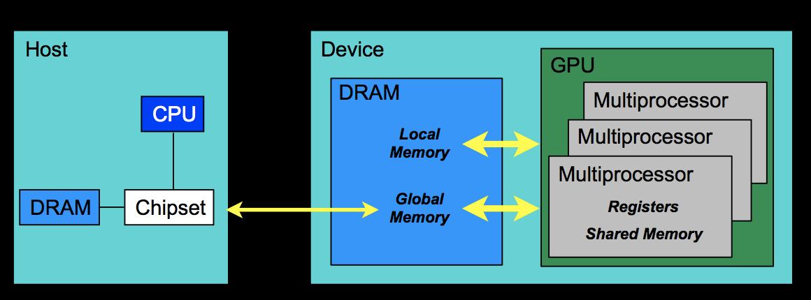
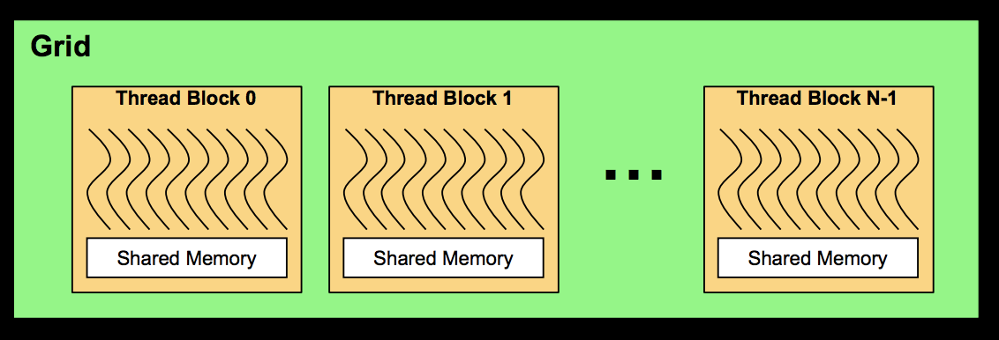

# Ray Tracing em GPU usando CUDA
Gabriel Moreira - 7º Semestre - Engenharia da Computação

## Programando em CUDA

O código em CUDA faz uso tanto da CPU, que é chamada de host, quanto da GPU,
chamada de device. Esses disposivos não compartilham suas memórias locais, ou seja, para que o dado da GPU seja lida pela CPU, depois do processamento, ele deve ser copiado para a memória da CPU e vice-versa. Um exemplo da relação entre o device e o host pode ser vista na __Figura 1__.


*__Figura 1:__ relação device-host*


Partes da aplicação na GPU são divididas em porções menores e executadas paralelamente em forma de _kernels_. Esses são executados um de cada vez em diferentes _threads_. As _threads_ em GPU possuem pequenos overheads de criação e é fácil de alternar entre elas em relação às de CPU. A placa de vídeos faz uso de milhares de _threads_ para aumentar seu desempenho, enquanto uma CPU muti-core possui um número muito menor.

Todas as _threads_ na GPU executam o mesmo código, porém elas possuem um _id_ que as diferencia e pode ser usado para controlar tais _threads_ com maior facilidade.

_Kernels_ executam uma _grid_ de blocos de _threads_, sendo que, as  _threads_ em um mesmo bloco cooperam entre si a partir de uma memória compartilhada. É importante realçar que _threads_ em diferentes blocos não cooperam entre si.
Essa relação pode ser vista na __Figura 2__.


*__Figura 2:__ exemplo de kernel grid com suas threads*

## Transformando Ray Tracing em CUDA

### Teste de kernel em funções básicas

A primeira coisa feita foi um teste para transformar a função __main__, que calcula os pixels e logo após printa no terminal em um kernel a ser executado na GPU.

```cpp
__global__ void kernel_function(float *pixel, int lenX, int lenY){
    // calcula o indice i da imagem com base na threadID, blockID e suas dimensões 
    int i = blockIdx.x * blockDim.x + threadIdx.x;
    int j = blockIdx.y * blockDim.y + threadIdx.y;

    // o index é criado para navegar em um vetor como se fosse uma matriz
    int index;
    index = i * 3 + j * lenX * 3;

    // condição que evita o cálculo para i e j fora da dimensão da imagem
    if((i >= lenX) || (j >= lenY)) return;

    // mesmo cálculo feito na função main, porém agora no kernel
    pixel[index + 0] = float(i) / lenX;
    pixel[index + 1] = float(j) / lenY;
    pixel[index + 2] = 0.2;
}
```

O código da função main passou a ser a chamada do kernel sem os dois loops para iterar sobre a imagem, uma vez que o kernel já faz isso.

```cpp
int main() {
    // tamanho da imagem (120 x 80 pixels)
    int nx = 120;
    int ny = 80;
    int num_pixels = nx*ny;

    // tamaho dos pixels é o número de canais da imagem (RGB) vezes
    // a quantidade de pixels vezes 
    // o tamanho que um float ocupa na memória
    size_t size_pixels = 3*num_pixels*sizeof(float);
    
    float *pixel;
    cudaMallocManaged((void **)&pixel, size_pixels);

    // definindo o tamanho do bloco
    dim3 blocks(nx/8+1,ny/8+1);

    // definindo threads
    dim3 threads(8,8);

    // chamando o kernel
    kernel_function<<<blocks, threads>>>(pixel, nx, ny);

    cudaGetLastError();
    cudaDeviceSynchronize();
    std::cout << "P3\n" << nx << " " << ny << "\n255\n";
    
    for (int j = ny-1; j >= 0; j--) {
        for (int i = 0; i < nx; i++) {

            // o index itera no vetor como se fosse uma matriz
            int index = j*3*nx + i*3;

            float r = pixel[index + 0];
            float g = pixel[index + 1];
            float b = pixel[index + 2];
            int ir = int(255.99*r); 
            int ig = int(255.99*g); 
            int ib = int(255.99*b); 
            std::cout << ir << " " << ig << " " << ib << "\n";
        }
    }
    cudaFree(pixel);
}
```

### Cálculo de vetores e raios em GPU

A ideia é fazer todos os cálculos dos raios e vetores em GPU. Para isso foi usado uma "flag" __device__ antes de métodos das classes _vec3_ e _ray_.
