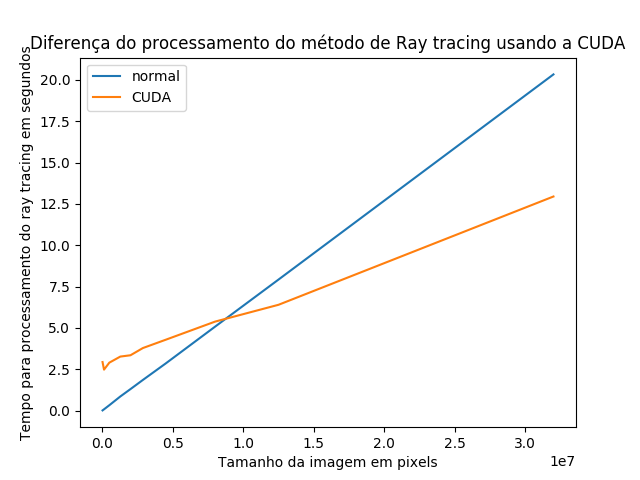

# Ray Tracing em GPU usando CUDA
Gabriel Moreira - 7º Semestre - Engenharia da Computação

## Programando em CUDA

O código em CUDA faz uso tanto da CPU, que é chamada de host, quanto da GPU,
chamada de device. Esses disposivos não compartilham suas memórias locais, ou seja, para que o dado da GPU seja lida pela CPU, depois do processamento, ele deve ser copiado para a memória da CPU e vice-versa. Um exemplo da relação entre o device e o host pode ser vista na __Figura 1__.


*__Figura 1:__ relação device-host*


Partes da aplicação na GPU são divididas em porções menores e executadas paralelamente em forma de _kernels_. Esses são executados um de cada vez em diferentes _threads_. As _threads_ em GPU possuem pequenos overheads de criação e é fácil de alternar entre elas em relação às de CPU. A placa de vídeos faz uso de milhares de _threads_ para aumentar seu desempenho, enquanto uma CPU muti-core possui um número muito menor.

Todas as _threads_ na GPU executam o mesmo código, porém elas possuem um _id_ que as diferencia e pode ser usado para controlar tais _threads_ com maior facilidade.

_Kernels_ executam uma _grid_ de blocos de _threads_, sendo que, as  _threads_ em um mesmo bloco cooperam entre si a partir de uma memória compartilhada. É importante realçar que _threads_ em diferentes blocos não cooperam entre si.
Essa relação pode ser vista na __Figura 2__.


*__Figura 2:__ exemplo de kernel grid com suas threads*

## Transformando Ray Tracing em CUDA

A ideia é fazer todos os cálculos dos raios e vetores em GPU. Para isso foi usado uma "flag" __device__ antes de métodos das classes _vec3_, _ray_, _hitable_ e _hitable_list_.

Foi definido que todos os vetores e dados necessários para o cálculo do Ray Tracing serão criados diretamente da GPU. Essa decisão foi feita porque existem diversos problemas que podem aparecer quando o dado é criado no host e passado para device por meio da função __cudaMemcpy__. Um desses problemas é a perda de ponteiros que possibilitam a herança de classes, recurso muito usado nesse projeto na criação de classes como hitable_list ou sphere.

Em razão disso, foi criado um kernel inicial que cria os dados necessários diretamente no device, chamado de __kernel_init__. Nesse kernel, são criados os dados como a lista de esferas que compõem o ambiente (_world_).

Criados os dados, foi feito o processamento e o real cálculo do ray tracing em outro kernel, chamado __kernel_function__. Tal kernel recebe como argumentos as dimensões da imagem, o ambiente (world) e o vetor de pixels no qual é colocado o resultado. O vetor de pixels, por sua vez é copiado de volta para a CPU e redirecionado para a saída std::cout.

O código abaixo se refere ao __main.cu__ do projeto e pode ser usado como referência.

```cpp
#include <iostream>
#include "sphere.h"
#include "hitable_list.h"
#include "float.h"
#include <chrono>
#include <unistd.h>

__device__ vec3 color(const ray& r, hitable *world) {
    hit_record rec;
    if (world->hit(r, 0.0, MAXFLOAT, rec)) {
        return 0.5*vec3(rec.normal.x()+1, rec.normal.y()+1, rec.normal.z()+1);
    }
    else {
        vec3 unit_direction = unit_vector(r.direction());
        float t = 0.5*(unit_direction.y() + 1.0);
        return (1.0-t)*vec3(1.0, 1.0, 1.0) + t*vec3(0.5, 0.7, 1.0);
    }
}

__global__ void kernel_function(float *pixels, int lenX, int lenY, hitable **world){

    // definindo os índices com base no id do bloco e da thread
    int i = blockIdx.x * blockDim.x + threadIdx.x;
    int j = blockIdx.y * blockDim.y + threadIdx.y;

    int index;
    vec3 lower_left_corner(-2.0, -1.0, -1.0);
    vec3 horizontal(4.0, 0.0, 0.0);
    vec3 vertical(0.0, 2.0, 0.0);
    vec3 origin(0.0, 0.0, 0.0);

    // se os índices forem maiores que imagens, a função não retorna nada
    if((i >= lenX) || (j >= lenY)) return;

    // calculo do ray tracing
    float u = float(i) / float(lenX);
    float v = float(j) / float(lenY);
    ray r(origin, lower_left_corner + u*horizontal + v*vertical);
    vec3 col = color(r, *world);
    
    // definindo indice do vetor da GPU para iterar como se fosse uma matriz
    index = i*3 + j*lenX*3;

    // preenchendo pixels
    pixels[index + 0] = col[0];
    pixels[index + 1] = col[1];
    pixels[index + 2] = col[2];
}

__global__ void kernel_init(hitable **list, hitable **world){

    // adiciona esferas na lista de hitables
    *(list) = new sphere(vec3(0,0,-1), 0.5);
    *(list+1) = new sphere(vec3(0,-100.5,-1), 100);
    *(list+2) = new sphere(vec3(1, 0,-1), 0.5);
    *(list+3) = new sphere(vec3(-1, 0,-1), 0.5);

    // cria world com a lista de hitables
    *world = new hitable_list(list, 3);

}

int main() {
    // começa a contar o tempo
    auto start = std::chrono::steady_clock::now();

    // tamanho da imagem (480 x 320)
    int nx = 480;
    int ny = 320;

    // definindo tamanho das variáveis
    int num_pixels = nx * ny;
    size_t size_pixels = 3 * num_pixels*sizeof(float);
    size_t size_list = 4 * sizeof(hitable *);
    size_t size_world = sizeof(hitable *);
    
    // cria pixels na memoria da GPU
    float *pixels;
    cudaMalloc((void **)&pixels, size_pixels);

    // cria pixels na memoria da CPU
    float *pixelsCPU;
    pixelsCPU = (float *)malloc(size_pixels);

    // cria list e word na memoria da GPU
    hitable **list;
    hitable **world;
    cudaMalloc((void **)&list, size_list);
    cudaMalloc((void **)&world, size_world);

    // definindo o tamanho do bloco
    dim3 blocks(nx/8+1,ny/8+1);

    // definindo threads
    dim3 threads(8,8);

    // chamando o kernel init para criar hitable list e world
    kernel_init<<<1, 1>>>(list, world);

    // sincronizar kernels
    cudaDeviceSynchronize();
    cudaGetLastError();

    // chamando a função que calcula os pixels
    kernel_function<<<blocks, threads>>>(pixels, nx, ny, world);

    // memcopy do pixel device -> host
    cudaMemcpy(pixelsCPU, pixels, size_pixels, cudaMemcpyDeviceToHost);

    cudaGetLastError();
    // copia valores do pixelCPU para imagem
    std::cout << "P3\n" << nx << " " << ny << "\n255\n";
    for (int j = ny-1; j >= 0; j--) {
        for (int i = 0; i < nx; i++) {
            int index = j*3*nx + i*3;
            float r = pixelsCPU[index + 0];
            float g = pixelsCPU[index + 1];
            float b = pixelsCPU[index + 2];
            int ir = int(255.99*r); 
            int ig = int(255.99*g); 
            int ib = int(255.99*b);
            std::cout << ir << " " << ig << " " << ib << "\n";
        }
    }
    // medicao de tempo
    auto end = std::chrono::steady_clock::now();
    std::cerr << "Elapsed time in seconds : " 
		<< std::chrono::duration<double>(end - start).count()
		<< " s" << std::endl;

}

```


## Desempenho

A máquina usada para a análise de desempenho foi uma instância _p2.xlarge_ da AWS que possui uma placa de vídeo Tesla K80 da NVIDIA.

|Método/Tamanho da imagem| 200x100| 500x250| 1000x500| 1600x800| 2000x1000| 2400x1200| 3000x1500| 4000x2000| 5000x2500| 8000x4000|
|--------|--------|---------|---------|---------|---------|---------|---------|---------|---------|---------|---|
|Normal| 0.0129 s|0.0794 s|0.32596 s|0.85498 s|1.3008 s|1.8543 s| 2.85305 s|5.07813 s| 7.92686 s|20.3372 s|
|CUDA|2.9374 s |2.4787 s |2.90023 s |3.26873 s |3.3477 s |3.784 s |4.28702 s |5.38314 s |6.40131 s |12.951 s|




*__Figura 2:__ gráfico de desempenho do ray tracing em CUDA em relação ao método processado na CPU*

## Conclusão

Existe um overhead da utilização da GPU em relação à CPU. Isso pode ser constatado uma vez que o desempenho do código em CUDA é bem pior para imagens com poucos pixels. Assim que o tamanho da imagem vai aumentando, a diferença entre o código em CUDA e o código normal vai diminuindo cada vez mais, até que chega em um ponto de convergência entre as duas retas na __Figura 3__.
Mesmo usando a GPU, existem alguns gargalos em relação ao desempenho, como a sincronização das threads e seus blocos que dever ser feito entre o uso dos kernels.

De forma geral, pode-se concluir que usar a GPU pode ser excelente em casos que uma grande quantidade de dados são usados, mas seu uso não vale a pena para imagens muito pequenas, por conta do overhead descrito acima.


## Referências


* Accelerated Ray Tracing in One Weekend in CUDA
    By Roger Allen | November 5, 2018
    https://devblogs.nvidia.com/accelerated-ray-tracing-cuda/

* Ray Tracing in One Weekend
    By Peter Shirley
    http://www.realtimerendering.com/raytracing/Ray%20Tracing%20in%20a%20Weekend.pdf

* Getting Started with CUDA
    Greg Ruetsch, Brent Oster
    https://www.nvidia.com/content/cudazone/download/Getting_Started_w_CUDA_Training_NVISION08.pdf